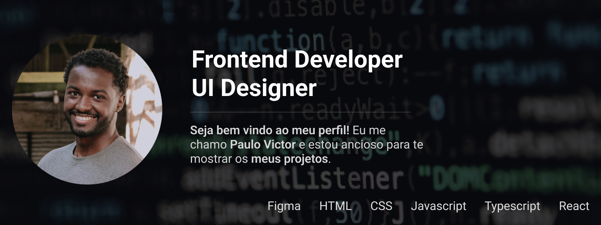

<!-- [](https://www.linkedin.com/in/paulopbi/) -->


[](https://git.io/typing-svg)

<div align="center">  
   
  
</div>

<br>

Hello world 👋🏾, my name is **Paulo Victor** and I'm currently based in **Rio de Janeiro - Brasil**, I've been passionate about technology since I was a child! I study **Análise e Desenvolvimento de Sistemas (Analysis and Systems Development)** at **Unicesumar** college, my stack is **Frontend Development & UI Design** and it's my main focous now, you can see some of personal and course projects here on <a href="https://github.com/paulopbi?tab=repositories">my github</a> or follow me @ social media bellow.

<a href="https://www.linkedin.com/in/paulopbi/"> &nbsp; </a>
<a href="https://github.com/paulopbi"> &nbsp; </a>
<a href="https://www.behance.net/paulopbi"> &nbsp; </a>

<br>

```diff
@@ Ever tried. Ever failed. No matter. Try Again. Fail again. Fail better. - Samuel Beckett @@

# Random info about me!
+ Living in Rio De Janeiro, Brazil.
+ College at Unicesumar.
+ Analise e Desenvolvimento de Sistemas.
+ Brazilian Portuguese and English speaker.

- Guitar player.
- Technology addicted.
- Gym athlete.

! Fullstack Development.
! Java, NodeJS, Javascript, C, SQL, UML, Figma, HTML, CSS.
```

### Skills
<!--Frontend-->
Frontend <br>
&nbsp;
&nbsp;
&nbsp;
&nbsp; 
&nbsp;
&nbsp;
&nbsp;
&nbsp;

<!--Design-->
Design <br>
&nbsp;
&nbsp;

<!--Backend-->
Backend <br>
&nbsp;
&nbsp;
&nbsp;
&nbsp;

<!--Others-->
Others <br>
&nbsp;
&nbsp;
&nbsp;
&nbsp;


